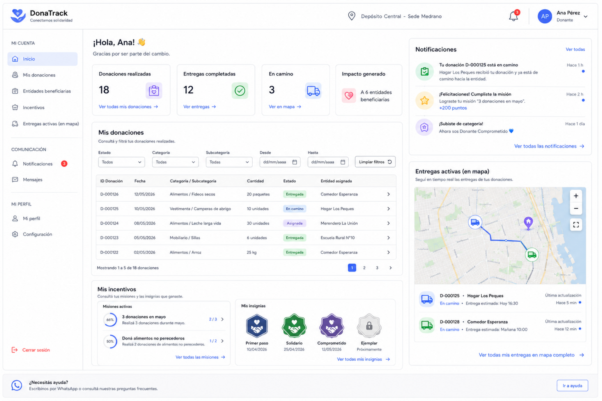
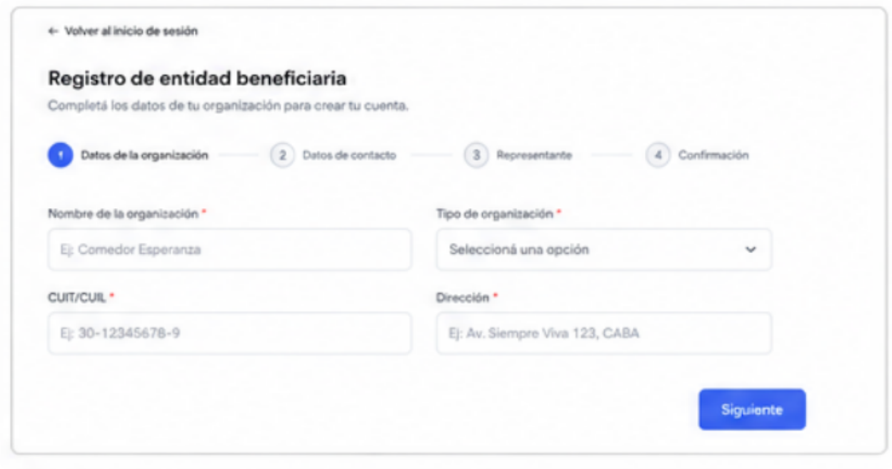
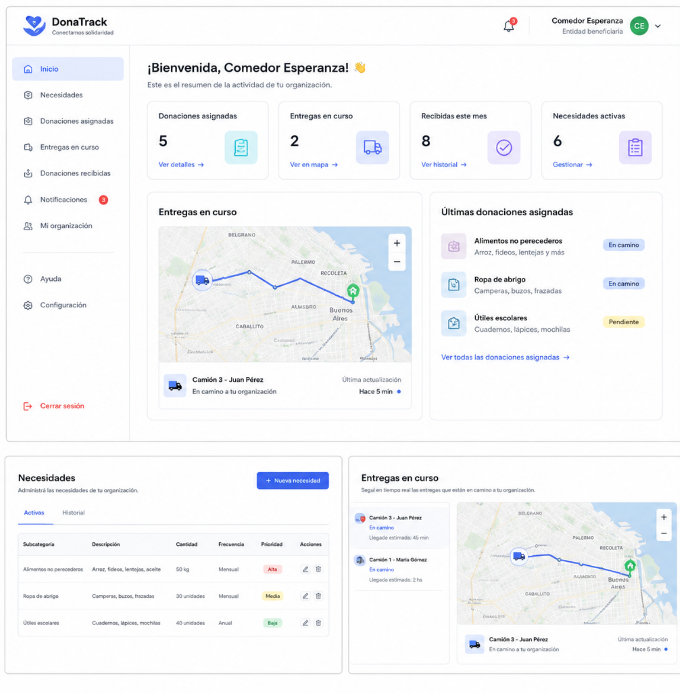
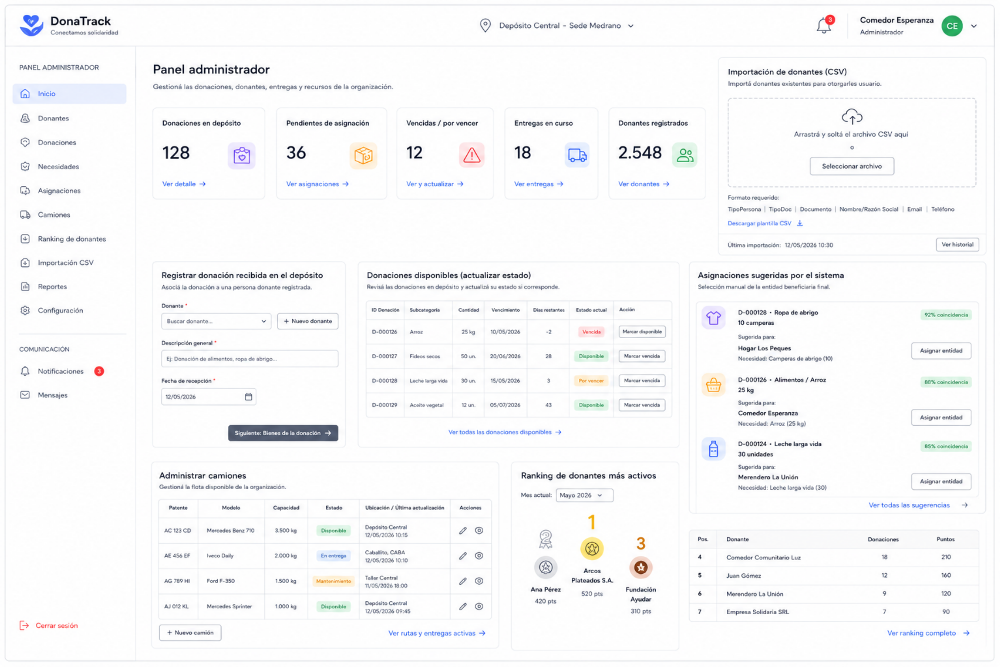
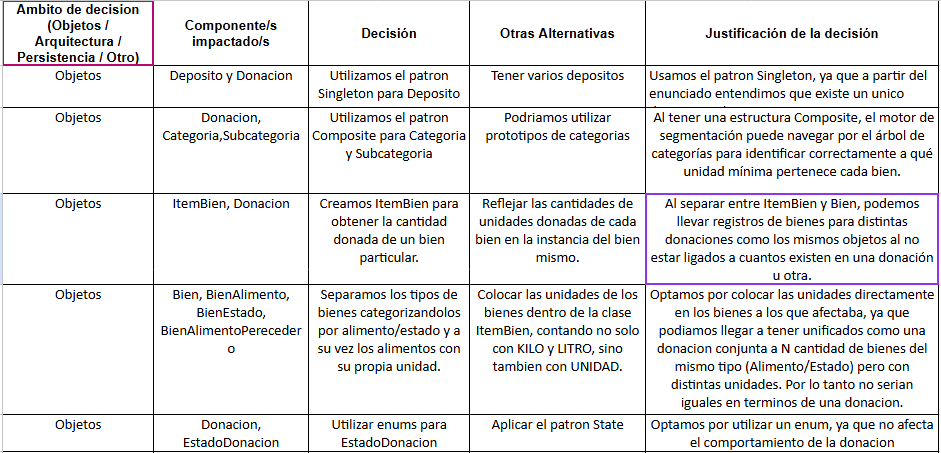

# Aqui se muestran las interfaces de usuario y justificaciones de diseño

## Interfaz de acceso:

## Interfaz donante:

## Interfaz entidad:

### Login/Register:

### Visualizar donaciones:

### Interfaz general de la entidad:

## Interfaz persona administradora

## Justificaciones de diseño

